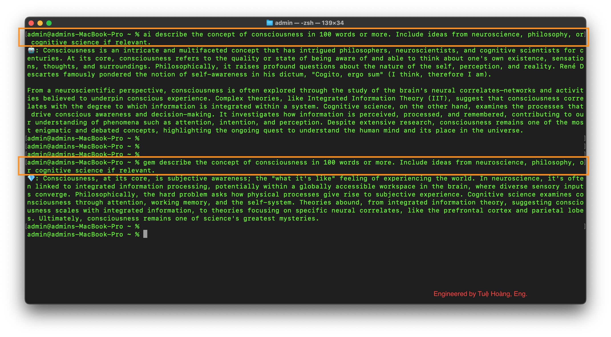
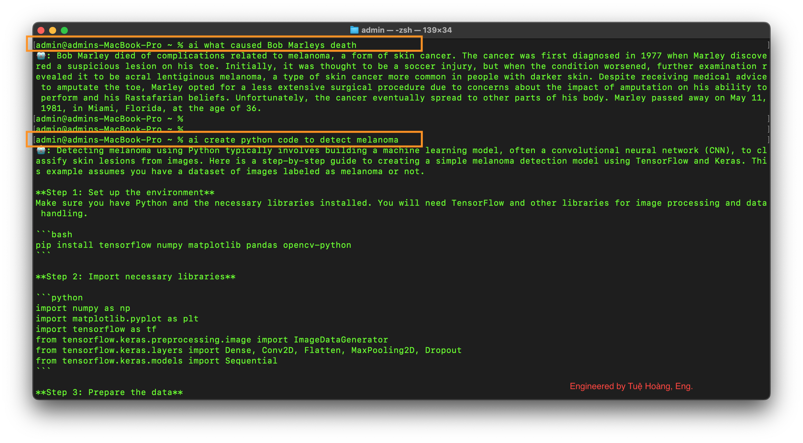

# NeuronShell-Intelligent-Terminal

- Dare to Dream
- Inspire Bold Leadership
- Embrace Diversity in Thought and Innovation
- Explore together & unlock the world's knowledge

----------------------

NeuronShell — Intelligent Terminal, Supercharged with AI

- Just type ai: followed by your thoughts — NeuronShell transforms the terminal into a smart, conversational assistant.

- Designed and Built for Developers: Whether you're a backend engineer, DevOps specialist, or weekend hobbyist, the ai-cli-shell stays out of the way — until you need it. Then, it’s powerful, responsive, and surprisingly helpful.

----------------------

## NeuronShell merges the intelligence of LLMs with the speed and power of the terminal.

- No tabs. No distractions. Just raw focus, now with intelligent support.

- Unlock the power of AI where you work most — the command line.

- Talk to the terminal like a collaborator or assistant. Ask questions, generate code, troubleshoot errors, or even summarize man pages — all without leaving the flow.

- No context-switching — Stay in the terminal and get instant answers

- Natural language understanding — Describe what you want; let the AI figure it out

- Smarter dev workflows — Explain code, debug shell errors, convert commands

- Customizable prompts — Tune the assistant for the project, stack, or style

- Offline-ready (optional LLM integration) — Use local Ollama models or connect to the favorite LLM API 

----------------------

### What's Possible?

- Ask about files in the repo: ai: explain this Python file

- Run LLM-powered tests: ai: write test cases for this function

- *Autocomplete shell commands based on intent: ai: compress all PNGs in this folder

- *Integrate with git, Docker, or Kubernetes: Smart suggestions for everyday CLI tools

- *Plugin system: Add custom tools, APIs, or model backends (like OpenAI, Gemini, Ollama local models, etc.)

----------------------

### Command Prefixes

You can interact with different AI models directly from your terminal by using simple command prefixes:

- `🤖 ai:` → Routes your prompt to **OpenAI** (e.g., GPT-4o)

- `💎 gem:` → Routes your prompt to **Gemini AI**

#### Example Usage

- `💎 gem:` summarize the theory of general relativity in simple terms.

- `🤖 ai:`  compress all PNGs in this folder

----------------------

### Finally, Making AI Fun:

- `💎 gem:` create python code to detect melanoma 

